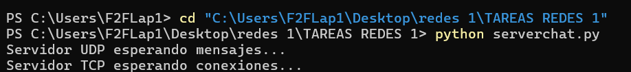
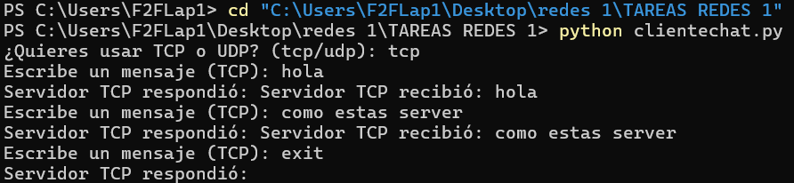
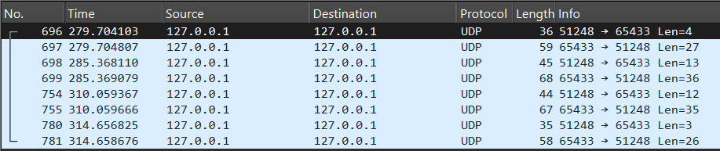
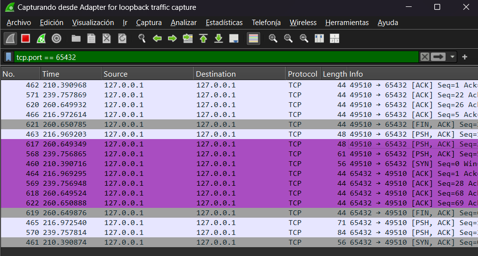

# Informe: Implementación de Comunicación Cliente-Servidor usando TCP y UDP en Python

## 1. Introducción
La comunicación entre dispositivos es fundamental en redes de computadoras. En este informe, exploramos la implementación de un sistema de comunicación Cliente-Servidor utilizando los protocolos **TCP (Transmission Control Protocol)** y **UDP (User Datagram Protocol)** en Python. Se explica el funcionamiento del programa, se analiza el código y se presentan posibles desafíos para mejorar la implementación.

## 2. Descripción del Proyecto
El programa consiste en un **servidor** que maneja conexiones TCP y UDP simultáneamente, y un **cliente** que se comunica con el servidor utilizando el protocolo seleccionado. La comunicación se mantiene activa hasta que el cliente envía la palabra **"exit"**.

## 3. Explicación del Código

## 3.1. Servidor
El servidor debe:
- Escuchar conexiones TCP y UDP en puertos específicos.
- Recibir mensajes y responder al cliente.
- Finalizar la comunicación cuando el cliente envía "exit".


#### **Código del Servidor**
```python
import socket
import threading

HOST = '127.0.0.1'  # Dirección local
TCP_PORT = 65432     # Puerto para TCP
UDP_PORT = 65433     # Puerto para UDP

# Funcionamiento del servidor TCP
def tcp_server():
    server = socket.socket(socket.AF_INET, socket.SOCK_STREAM)
    server.bind((HOST, TCP_PORT))
    server.listen()
    print("Servidor TCP esperando conexiones...")

    conn, addr = server.accept()
    print(f"Conectado con {addr}")
    while True:
        data = conn.recv(1024).decode()
        if data.lower() == 'exit':
            break
        print("Mensaje recibido (TCP):", data)
        conn.sendall(f"Servidor TCP recibió: {data}".encode())
    conn.close()

# Funcionamiento del servidor UDP
def udp_server():
    server = socket.socket(socket.AF_INET, socket.SOCK_DGRAM)
    server.bind((HOST, UDP_PORT))
    print("Servidor UDP esperando mensajes...")

    while True:
        data, addr = server.recvfrom(1024)
        message = data.decode()
        if message.lower() == 'exit':
            break
        print("Mensaje recibido (UDP):", message)
        server.sendto(f"Servidor UDP recibió: {message}".encode(), addr)

# Iniciar ambos servidores en hilos diferentes
tcp_thread = threading.Thread(target=tcp_server)
udp_thread = threading.Thread(target=udp_server)

tcp_thread.start()
udp_thread.start()
```

<!-- Esta es una sección que Explicación Línea por Línea**
- **Líneas 1-2:** Importamos los módulos necesarios para manejar sockets y subprocesos (hilos).
- **Líneas 4-6:** Definimos la dirección IP y los puertos TCP y UDP.
- **Líneas 9-22:** Implementamos el servidor TCP:
  - Creamos un socket TCP, lo enlazamos a un puerto y lo ponemos en escucha.
  - Aceptamos una conexión entrante y entramos en un bucle para recibir y responder mensajes.
  - Si el cliente envía "exit", cerramos la conexión.
- **Líneas 25-37:** Implementamos el servidor UDP:
  - Creamos un socket UDP y lo enlazamos a un puerto.
  - Recibimos mensajes y respondemos a los clientes.
- **Líneas 40-44:** Creamos dos hilos para que TCP y UDP funcionen simultáneamente.
-->
- ### iniciamos el server

----


## 3.2. Cliente
El cliente debe:
- Conectarse al servidor mediante TCP o UDP.
- Enviar mensajes y recibir respuestas.
- Finalizar la comunicación cuando se envíe "exit".

#### **Código del Cliente**
```python
import socket

HOST = '127.0.0.1'
TCP_PORT = 65432
UDP_PORT = 65433

protocol = input("¿Quieres usar TCP o UDP? (tcp/udp): ").strip().lower()

if protocol == "tcp":
    client = socket.socket(socket.AF_INET, socket.SOCK_STREAM)
    client.connect((HOST, TCP_PORT))
    while True:
        msg = input("Escribe un mensaje (TCP): ")
        client.sendall(msg.encode())
        response = client.recv(1024).decode()
        print("Servidor TCP respondió:", response)
        if msg.lower() == 'exit':
            break
    client.close()

elif protocol == "udp":
    client = socket.socket(socket.AF_INET, socket.SOCK_DGRAM)
    while True:
        msg = input("Escribe un mensaje (UDP): ")
        client.sendto(msg.encode(), (HOST, UDP_PORT))
        response, _ = client.recvfrom(1024)
        print("Servidor UDP respondió:", response.decode())
        if msg.lower() == 'exit':
            break
    client.close()
```

<!-- #### **Explicación Línea por Línea**
- **Líneas 1-4:** Importamos el módulo `socket` y definimos IP y puertos.
- **Línea 6:** Preguntamos al usuario si quiere usar TCP o UDP.
- **Líneas 8-18:** Si el usuario elige TCP:
  - Creamos y conectamos un socket TCP.
  - Enviamos mensajes y recibimos respuestas.
  - Finalizamos al enviar "exit".
- **Líneas 20-29:** Si el usuario elige UDP:
  - Creamos un socket UDP.
  - Enviamos mensajes y recibimos respuestas.
  - Finalizamos con "exit".
-->
  

---

## 4. Funcionalidad del Cliente y Servidor

A continuación, se presentan ejemplos de ejecución tanto del cliente como del servidor, mostrando cómo interactúan utilizando TCP y UDP.

### 4.1. Cliente TCP
Ejemplo de comunicación entre el cliente y el servidor usando TCP:

```
¿Quieres usar TCP o UDP? (tcp/udp): tcp
Escribe un mensaje (TCP): Hola, Servidor TCP
Servidor TCP respondió: Servidor TCP recibió: Hola, Servidor TCP
Escribe un mensaje (TCP): exit
```



### 4.2. Cliente UDP
Ejemplo de comunicación entre el cliente y el servidor usando UDP:

```
¿Quieres usar TCP o UDP? (tcp/udp): udp
Escribe un mensaje (UDP): Hola, Servidor UDP
Servidor UDP respondió: Servidor UDP recibió: Hola, Servidor UDP
Escribe un mensaje (UDP): exit
```


---

## 5. Captura de Tráfico con Wireshark

Se puede usar **Wireshark** para capturar el tráfico de red mientras el cliente y el servidor se comunican. A continuación, se muestra una breve descripción de cómo realizar la captura.

### 5.1. Instrucciones para Captura con Wireshark

1. **Abrir Wireshark**: Ejecutar Wireshark en la misma máquina donde se ejecuta el servidor y el cliente.
2. **Seleccionar la interfaz de red**: Seleccionar la interfaz de red local (generalmente "lo0" o "eth0" en sistemas basados en Linux, o "Wi-Fi" en Windows).
3. **Iniciar la captura**: Hacer clic en el botón de inicio para comenzar a capturar el tráfico.
4. **Filtrar por protocolos**: Para observar específicamente las conexiones TCP y UDP, usar los siguientes filtros en Wireshark:
   - **Para TCP**: `tcp.port == 65432`
   - **Para UDP**: `udp.port == 65433`
5. **Observar la comunicación**: Ver los paquetes enviados y recibidos, y analizar el contenido de los mensajes transmitidos entre el cliente y el servidor.


### 5.2. Captura de Tráfico UDP



### 5.3. Captura de Tráfico TCP


---

## 6. Desafíos Presentados Durante el Desarrollo del Código

1. **Configuración de puertos**: Al seleccionar los puertos ya estaban ocupados asi que habia que detenerlos, use : 
---

## 7. Conclusión
Este proyecto demuestra cómo implementar la comunicación Cliente-Servidor con TCP y UDP en Python. La explicación del código permite comprender su funcionamiento, y los desafíos presentados durante el desarrollo proporcionan valiosas lecciones. La integración con herramientas como Wireshark también es útil para analizar el tráfico y comprender cómo se gestionan las conexiones en la red.

🚀
